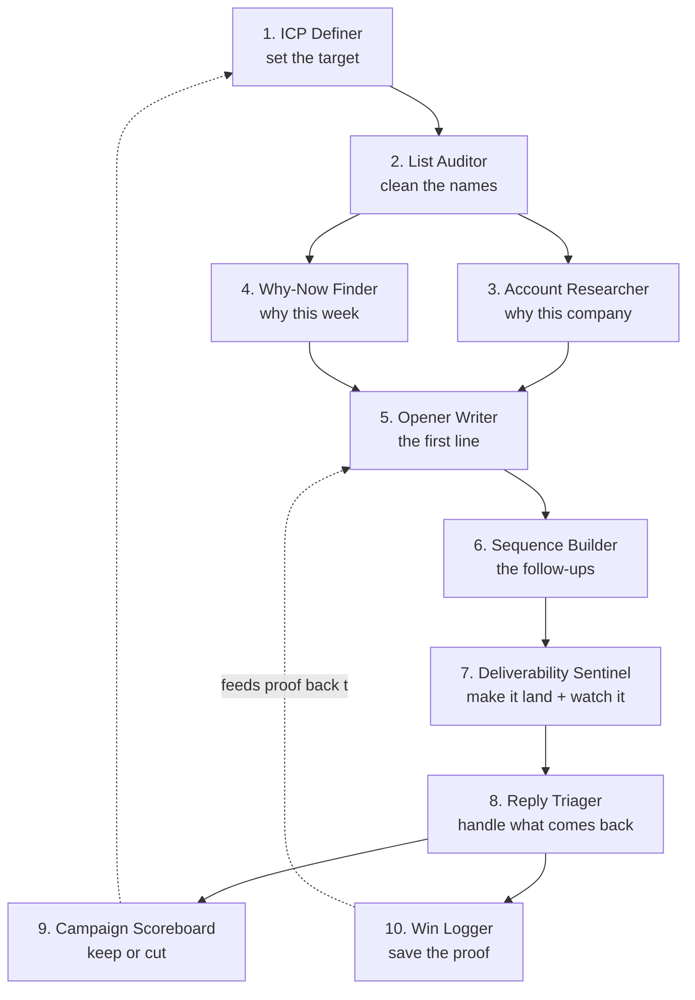

# The Cold Email Operating System

**Ten Claude skills that run your cold outbound end to end — from ICP to logged win — as one repeatable pipeline you can install in two minutes.**

Cold email goes wrong in the same places for almost everyone: a soft list, random timing, a robotic first line, follow-ups that just say "bumping this," and no record of what actually worked. This is a set of ten small, plain-text skill files — one for each part of a real outbound pipeline — that you drop into Claude so the whole thing runs the same way every time. No new paid tool. No code. No lock-in. Just files you own.

> **What's a "skill"?** A skill is a plain-text instruction file (`SKILL.md`) that holds a process — how to define an ICP, how to write an opener, how to score a campaign — written down once so Claude runs it consistently. Save it to `~/.claude/skills/` and it becomes a command you can call. That's the whole idea: your process, saved as a file, repeatable forever.

---

## Who this is for

- **Founders and operators** running their own outbound who are tired of it being a scattered mess of tabs and guesswork.
- **Agencies and SDR teams** who want a shared, consistent playbook every rep runs the same way.
- **Anyone** who has read a hundred cold-email threads and wants the good parts installed as tools, not bookmarks.

You do **not** need to be technical. If you can copy a folder, you can install this.

---

## Install in 2 minutes

```bash
# 1. Clone the repo (or download the ZIP and unzip it)
git clone https://github.com/your-org/cold-email-operating-system.git
cd cold-email-operating-system

# 2. Copy the ten skill folders into your Claude skills directory
#    macOS / Linux:
cp -r skills/* ~/.claude/skills/
#    Windows (PowerShell):
#    Copy-Item -Recurse skills\* $HOME\.claude\skills\

# 3. Restart Claude Code (or your Claude client) so it picks up the new skills.
```

That's it. Each folder in `skills/` is one installable skill. Invoke a skill by its name — for example, ask Claude to run the **ICP Definer** or the **Deliverability Sentinel**, or reference the skill by name in your prompt. See [`INSTALL.md`](INSTALL.md) for the step-by-step version, other clients, and troubleshooting.

> **Prefer the reading version first?** Every skill is also written up as a landing-page guide with the benchmarks, the 15-minute build, and a copy-paste starter prompt. This repo is the installable version of that guide.

---

## The 10 skills

| # | Skill | What it does | Stage |
|---|-------|--------------|-------|
| 1 | **ICP Definer** | Turns "we sell to B2B founders" into a tight, filterable profile: titles, size, the buying trigger, hard disqualifiers. Every other skill reads this file first. | Targeting |
| 2 | **List Auditor** | Scores a raw list against your ICP *before* you pay to verify it. Flags role accounts and catch-alls; splits into keep / check / drop. | Targeting |
| 3 | **Account Researcher** | Briefs one company in five lines: what they sell, where they're stuck in your area, and the one specific detail to open with. | Research |
| 4 | **"Why Now" Finder** | Finds the timing signal — funding, a relevant hire, a job post, a new location — that makes *this week* the right week to reach out. | Research |
| 5 | **Opener Writer** | Writes the first line, and only the first line: signal → implication → proof, with hard rules against the phrases that get an email deleted. | Copy |
| 6 | **Sequence Builder** | Designs 4-7 follow-ups where each touch adds a new angle or proof — never "just bumping this." | Copy |
| 7 | **Deliverability Sentinel** | The pre-send gate and the daily alarm: warmup, per-inbox volume, plain text, bounce watch. Protects your domains. | Delivery |
| 8 | **Reply Triager** | Sorts replies into interested / not now / wrong person / objection and drafts responses — but never sends. You keep the button. | Delivery |
| 9 | **Campaign Scoreboard** | Pulls the numbers that matter (positive reply rate, not opens) and tells you plainly what to cut and what to feed. | Measure |
| 10 | **Win Logger** | Captures every proof point the moment it lands and files the one reusable stat, so your best material writes your next outreach. | Compound |

Each skill's full instructions live in `skills/<n>-<name>/SKILL.md`.

---

## How they chain into one pipeline

On their own, these are ten helpers. Chained, they are one loop you run every week — and each one reads the ICP file first, so the whole pipeline stays pointed at the same person.



Plain-English version of the same loop:

```
ICP Definer  →  sets the target
   ↓
List Auditor  →  cleans the names against it
   ↓
Account Researcher + Why-Now Finder  →  turn survivors into real reasons to reach out
   ↓
Opener Writer + Sequence Builder  →  turn reasons into a campaign
   ↓
Deliverability Sentinel  →  makes sure it lands, then watches it run
   ↓
Reply Triager  →  handles what comes back
   ↓
Campaign Scoreboard  →  says what to keep and what to cut
   ↓
Win Logger  →  feeds the wins back to the top, so the next openers are built on proof
```

That's the whole system. It is not a weekend project — it's a handful of files that get smarter every time you run a campaign.

---

## Start with these 2

You don't have to build all ten at once. The two that make everything else worth building:

1. **The ICP Definer (#1)** — because every other skill reads its output. A loose ICP silently weakens the list, the research, the opener, and the score. Get this tight first.
2. **The Deliverability Sentinel (#7)** — because it protects the asset the whole pipeline depends on: your sending domains. The best copy in the world does nothing from the spam folder.

Install those two, run a campaign through them, then add the next skill once the first has earned its place.

---

## The numbers this is built on

These skills bake in 2026 cold-email consensus so you don't have to memorize it. A few of the load-bearing ones:

- **Personalization is binary** — first-name/company tokens reply around **3%**; genuine business-context relevance jumps to **15-30%**. There's almost no middle.
- **Sending limits** — **20-25 emails per inbox per day**, scale by adding inboxes, never by raising the ceiling. Warm every inbox **2-4 weeks** and keep warming it.
- **Bounce is an alarm** — many operators auto-pause at **2%**; past **5%** is a reputation emergency.
- **Follow-ups matter** — about **58% of replies come from email one, 42% from the follow-ups**. Sweet spot: **4-7 touches, 3-4 days apart**, each adding something new.
- **Score on positive reply rate, not opens** — reply rate averages **1-5%** (good is 10%+); positive reply rate averages **0.1-0.5%** (good is 1-3%). Open tracking is off — it's noise now, and can hurt placement.

Every skill file cites the benchmark behind its rules. Nothing here is invented.

---

## What's in this repo

```
cold-email-operating-system/
├── README.md            ← you are here
├── INSTALL.md           ← step-by-step install + troubleshooting
├── LICENSE              ← MIT, use it however you like
├── cold-email-os-skills.zip   ← the skills/ folder, zipped, for non-git folks
└── skills/
    ├── 01-icp-definer/SKILL.md
    ├── 02-list-auditor/SKILL.md
    ├── 03-account-researcher/SKILL.md
    ├── 04-why-now-finder/SKILL.md
    ├── 05-opener-writer/SKILL.md
    ├── 06-sequence-builder/SKILL.md
    ├── 07-deliverability-sentinel/SKILL.md
    ├── 08-reply-triager/SKILL.md
    ├── 09-campaign-scoreboard/SKILL.md
    └── 10-win-logger/SKILL.md
```

---

## License

MIT — see [`LICENSE`](LICENSE). Use it, fork it, adapt it to your own outbound, ship it inside your own team. No attribution required (though it's always appreciated).

---

## Who made this

This system was built and open-sourced by the team at **Bleed AI**, an AI-powered cold-outbound agency. We run this exact pipeline — tightened, automated, and pointed at our clients' outbound — every day. This is the genericized, install-it-yourself version, and it stands entirely on its own.

If reading through it makes you think *"I should really systematize this"* — that's usually the sign it's time to talk to someone who already has. That's the work we do. No pitch here; the repo is the value. But the door's open at [bleedai.com](https://bleedai.com) if you'd rather have it built for you.

**Built something with it? Improved a skill? Open a PR — this is meant to be forked.**
